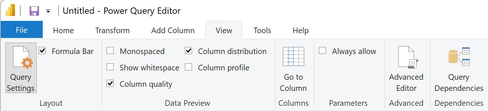
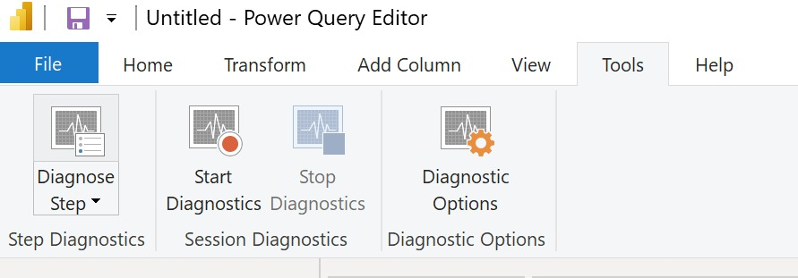
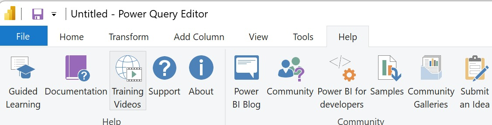

## **Power BI - Tool Images - Cheat Sheet**

### **Power BI Desktop**

**Power BI Desktop - Home**

    </img>

**Power BI Desktop - Insert**

    </img>

**Power BI Desktop - Modeling**

    </img>

**Power BI Desktop - View**

    </img>

**Power BI Desktop - Optimize**

    </img>

**Power BI Desktop - Help**

    </img>

---

### **Power BI - Power Query Editor**

**Power BI - Power Query - Home**

    </img>

**Power BI - Power Query - Transform**

    </img>

**Power BI - Power Query - Add Column**

    </img>

**Power BI - Power Query - View**

    </img>

**Power BI - Power Query - Tool**

    </img>

**Power BI - Power Query - Help**

    </img>

---

